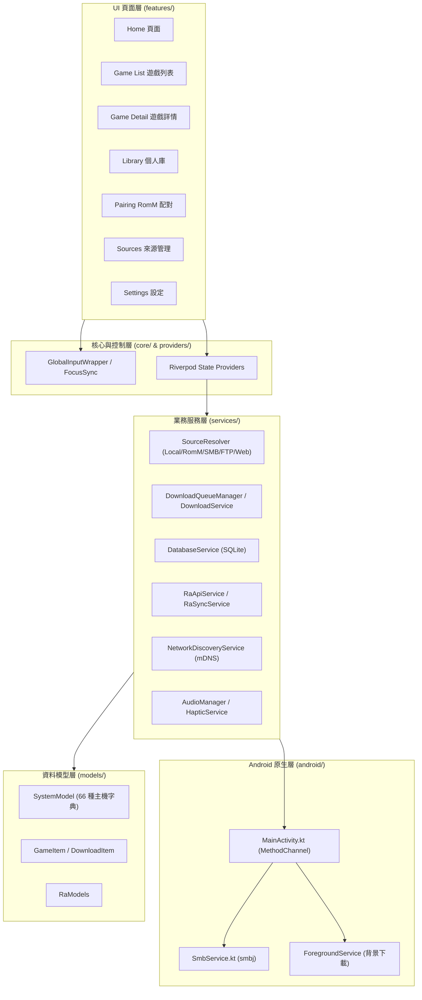

# R-Shop (retro_eshop) 專案架構說明文件

## 1. 專案名稱與簡述

- **專案名稱**：R-Shop (`retro_eshop` / `com.retro.rshop.tw`)
- **目前版本**：v1.7.0
- **專案簡述**：
  R-Shop 是一款專為 Android 掌機（如 Anbernic, Retroid Pocket, AYN Odin 等）與 Android TV 裝置設計的「控制器優先（Controller-First）」復古遊戲庫管理器與下載前端。本專案採用類似 Nintendo eShop 的現代主機風格視覺介面，支援 Local、RomM、SMB、FTP 及 Web 等多源統一遊戲庫管理。系統內建 66 種經典主機分類自動映射、遊戲封面與元資料自動抓取、RetroAchievements 玩家成就整合比對，以及完整的前台與背景下載佇列管理機制。

---

## 2. 模組劃分與依賴關係

R-Shop 採用 Flutter 跨平台 UI 與 Android 原生 (Kotlin) 結合的架構設計。

### 模組劃分

- **Flutter 應用層 (`lib/`)**：
  - `core/`：控制器 Focus/D-pad 焦點控制、響應式主機風格 Layout、視覺主題與通用 UI 元件。
  - `features/`：各功能頁面模組（`home`, `game_list`, `game_detail`, `library`, `onboarding`, `pairing`, `sources`, `settings`）。
  - `models/`：核心資料模型，如包含 66 種主機字典的 `SystemModel`、`GameItem`、`DownloadItem` 與 RetroAchievements 模型 `RaModels`。
  - `providers/`：基於 Riverpod 的狀態管理層。
  - `services/`：核心業務服務，包含多源解析（`SourceResolver`）、下載佇列管理、SQLite 資料庫、快取機制、成就比對與 mDNS 網路探索。
  - `l10n/`：多國語言國際化（i18n）支援。
- **Android 原生層 (`android/app/`)**：
  - `MainActivity.kt`：Flutter 與 Android 原生互動橋樑，處理解壓（Zip Extractor）、儲存權限與 SMB 管道溝通（Platform Channels）。
  - `SmbService.kt`：基於 `smbj` 函式庫的低階 SMB 網路檔案存取服務。
  - `ForegroundService`：Android 前台服務，負責背景下載與任務保活。

### 模組依賴圖 (Mermaid)



---

## 3. 關鍵類別與組件

| 類別 / 組件名稱 | 所在檔案 / 模組 | 主要職責與說明 |
| :--- | :--- | :--- |
| `RShopApp` | [lib/main.dart](file:///c:/Users/Mini-PC/StudioProjects/R-Shop/lib/main.dart) | 應用程式根 Widget，初始化 Theme、Localization、Riverpod 範疇與全域輸入監聽器。 |
| `SystemModel` | `lib/models/system_model.dart` | 定義 66 種復古遊戲主機字典（包含 NES, SNES, PS1, GBA 等），提供 Platform ID、顯示名稱、副檔名與預設目錄映射。 |
| `DatabaseService` | [lib/services/database_service.dart](file:///c:/Users/Mini-PC/StudioProjects/R-Shop/lib/services/database_service.dart) | 管理本地 SQLite 資料庫，負責遊戲元資料、來源設定、下載歷史與成就資料的高效 CRUD 操作。 |
| `DownloadQueueManager` | [lib/services/download_queue_manager.dart](file:///c:/Users/Mini-PC/StudioProjects/R-Shop/lib/services/download_queue_manager.dart) | 管理下載作業佇列，控制並行下載數量、任務優先順序、重試機制與自動解壓縮（Unzip）觸發。 |
| `DownloadService` | [lib/services/download_service.dart](file:///c:/Users/Mini-PC/StudioProjects/R-Shop/lib/services/download_service.dart) | 執行具體的檔案下載邏輯（支援斷點續傳、 HTTP/FTP/SMB 流式讀寫）並與 Android 前台服務同步狀態。 |
| `SourcesNotifier` | [lib/services/sources_notifier.dart](file:///c:/Users/Mini-PC/StudioProjects/R-Shop/lib/services/sources_notifier.dart) | 負責多來源（Local, RomM, SMB, FTP, Web）配置的狀態監控與狀態變更廣播。 |
| `SourceResolver` | [lib/services/source_resolver.dart](file:///c:/Users/Mini-PC/StudioProjects/R-Shop/lib/services/source_resolver.dart) | 統一抽象化異構來源的檔案掃描與存取介面，將不同通訊協定轉換為標準化的 `GameItem` 物件。 |
| `SmbService` | [android/app/src/main/kotlin/com/retro/rshop/tw/SmbService.kt](file:///c:/Users/Mini-PC/StudioProjects/R-Shop/android/app/src/main/kotlin/com/retro/rshop/tw/SmbService.kt) | Kotlin 原生層 SMB 服務，使用 `smbj` 處理網路芳鄰共享目錄的認證、檔案列舉與高效串流傳輸。 |
| `NativeSmbService` | [lib/services/native_smb_service.dart](file:///c:/Users/Mini-PC/StudioProjects/R-Shop/lib/services/native_smb_service.dart) | Flutter 端呼叫原生 SMB 服務的 MethodChannel 封裝介面。 |
| `RaApiService` | [lib/services/ra_api_service.dart](file:///c:/Users/Mini-PC/StudioProjects/R-Shop/lib/services/ra_api_service.dart) | RetroAchievements 官方 REST API 的介面服務，查詢玩家成就、遊戲雜湊碼與解鎖進度。 |
| `RaSyncService` | [lib/services/ra_sync_service.dart](file:///c:/Users/Mini-PC/StudioProjects/R-Shop/lib/services/ra_sync_service.dart) | 計算 ROM 檔案雜湊值（MD5/SHA1）並與 RetroAchievements 進行自動比對與同步。 |
| `GlobalInputWrapper` | `lib/core/input/` | 捕獲 D-pad、手把按鈕與鍵盤事件，統一進行焦點導向與頁面動作轉發。 |
| `FocusSyncManager` | `lib/core/focus/` | 掌機與 Android TV 的手把焦點同步管理器，確保無觸控環境下的流暢選單導覽體驗。 |

---

## 4. 技術棧與關鍵依賴

| 分類 | 技術 / 套件名稱 | 版本 | 說明與用途 |
| :--- | :--- | :--- | :--- |
| **開發語言** | Dart / Kotlin | Dart 3.x / Java 17 | Flutter 應用層程式碼與 Android 原生邏輯編寫 |
| **UI 框架** | Flutter | 3.x (Material 3) | 跨平台主機風格 UI 渲染與動態元件設計 |
| **狀態管理** | `flutter_riverpod` | `2.6.1` | 響應式狀態管理與依賴注入 |
| **原生溝通** | Kotlin MethodChannel & EventChannel | Standard | Flutter 與 Android Native (Zip, Storage, SMB) 通訊 |
| **網路傳輸** | `dio` | `5.9.1` | HTTP / REST API 請求庫（用於 Web 來源與 API） |
| **SMB 網路** | `smbj` (Java/Kotlin) | `0.13.0` | 處理 Windows / NAS 的 SMB2/SMB3 檔案共享傳輸 |
| **FTP 協定** | `ftpconnect` | Standard | 支援 FTP / FTPS 協定伺服器掃描與下載 |
| **網路發現** | mDNS / Zeroconf | Standard | 區域網路內 RomM 伺服器與 SMB 裝置自動發現 |
| **本地資料庫**| `sqflite` | `2.4.2` | 高效能 SQLite 儲存遊戲元資料與應用設定 |
| **圖片快取** | `cached_network_image` | `3.4.1` | 網路封面圖檔的本地記憶體與硬碟雙層快取 |
| **掃描器** | `mobile_scanner` | `5.2.3` | 相機與圖片相簿 QR Code 快速配對 RomM 伺服器 |
| **多媒體音效**| `flutter_soloud` | `2.1.7` | 高效能低延遲音效引擎，模擬主機選單音效 |
| **背景任務** | `flutter_foreground_task` | `9.2.0` | Android 前台服務，保障背景下載與解壓縮不中斷 |

---

## 5. 主要功能總覽

1. **控制器優先 UI（Controller-First / D-pad 焦點管理）**
   - 專為手持掌機與電視遙控器設計的焦點管理系統，無需觸控螢幕即可完美流暢操作所有選單、列表與設定。
2. **多源統一遊戲庫 (Multi-Source Unified Library)**
   - 無縫整合 Local（本地儲存）、RomM 伺服器、SMB 網路共享、FTP 伺服器與 Web 來源，將分散的 ROM 集中於統一介面管理。
3. **RomM QR 碼快速配對**
   - 支援透過相機掃描或載入圖片進行 RomM 伺服器一鍵 API Key / URL 自動配置與憑證綁定。
4. **自動辨識與元資料補全 (66 種主機字典)**
   - 內建 66 種經典主機（NES, SNES, N64, Game Boy, PS1, PSP 等）辨識規格，自動掃描並補全遊戲名稱、封面、發行年份與描述。
5. **後台下載與自動解壓**
   - 支援佇列下載、斷點續傳與背景 Task 保活，並於下載完成後自動觸發 Native Zip 檔案解壓與目錄歸檔。
6. **RetroAchievements 成就比對**
   - 自動計算 ROM checksum 雜湊，比對 RetroAchievements 成就資料庫，即時顯示玩家成就進度與徽章獎勵。
7. **智慧記憶體與快取適應**
   - 針對記憶體較小的 Android 掌機進行圖片與列表快取最佳化，防止載入大量高畫質封面時發生 OOM (Out of Memory)。

---

## 6. 目錄結構摘要

```
R-Shop/
├── android/                   # Android 原生專案
│   └── app/src/main/kotlin/
│       └── com/retro/rshop/tw/
│           ├── MainActivity.kt # Platform Channels (Zip, Storage, Method Call)
│           └── SmbService.kt   # smbj SMB 檔案存取原生服務
├── assets/                    # 靜態資源 (圖示、預設音效、UI 圖片)
├── docs/                      # 說明文件與開發手冊
├── lib/                       # Flutter 核心業務邏輯
│   ├── core/                  # 手把焦點控制、主題佈局與通用 UI 元件
│   ├── features/              # 功能模組頁面
│   │   ├── game_detail/       # 遊戲詳情與成就展示
│   │   ├── game_list/         # 分類遊戲列表
│   │   ├── home/              # 主頁面 (eShop 風格輪播與推薦)
│   │   ├── library/           # 已下載與本地遊戲庫
│   │   ├── onboarding/        # 新手引導
│   │   ├── pairing/           # RomM QR 配對頁面
│   │   ├── settings/          # 系統與下載設定
│   │   └── sources/           # 來源管理與掃描配置
│   ├── l10n/                  # 多國語言 (i18n) 檔案
│   ├── models/                # SystemModel (66種主機), GameItem, DownloadItem
│   ├── providers/             # Riverpod 狀態提供者
│   ├── services/              # 資料庫、下載佇列、SMB/FTP/Web 解析、RA 成就服務
│   ├── utils/                 # 工具函式 (檔案處理、字串解析)
│   ├── widgets/               # 全域共用 UI 控制項
│   └── main.dart              # 應用程式入口
├── pubspec.yaml               # 專案依賴與資源配置
└── ARCHITECTURE.md            # 專案架構說明文件 (本文件)
```
