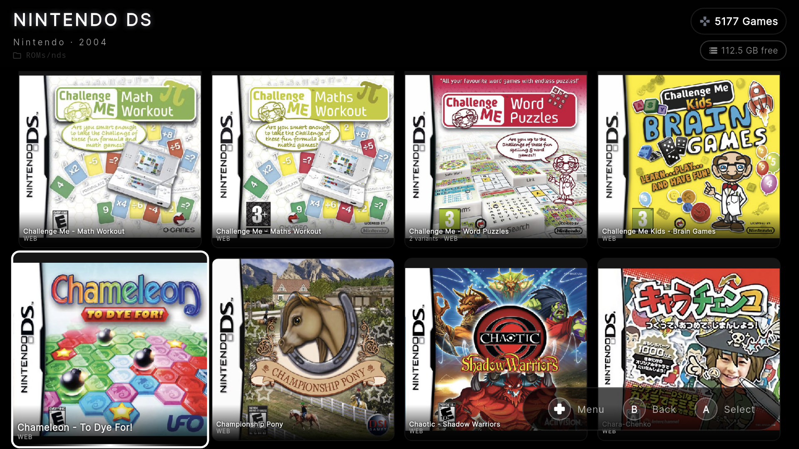
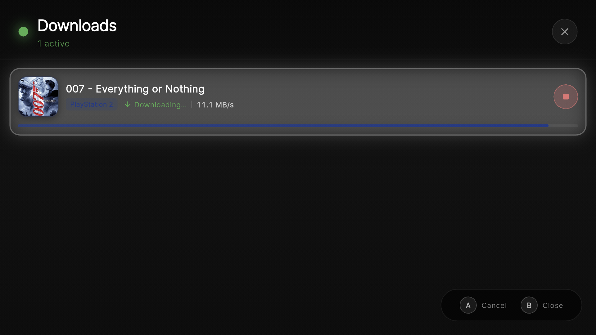

# 🎮 R-Shop

**The eShop your Retro Handheld was missing.**
A premium, console-native game manager for Android. Built for handhelds, perfected for controllers, and designed for the retro community.

  

  
  

  
  
  
  

---

## 🌟 Why R-Shop?

R-Shop isn't just a file browser; it's a **native console experience**. It bridges the gap between your self-hosted storage (**RomM, SMB, FTP**) and your handheld device (Odin, Retroid, Anbernic), providing a UI that feels like it was built by a major manufacturer.

> **🛡️ Neutrality Policy:** R-Shop is a technical tool and directory browser. It does **not** host, distribute, or provide links to copyrighted content. You provide the sources; R-Shop provides the experience.

---

## ✨ Key Features

* **📚 Library Screen** – Unified cross-system game browser with All/Installed/Favorites tabs, search, sort modes, and adjustable grid zoom (LB/RB).
* **⚡ Quick Menu (Start Button)** – Contextual overlay with shortcuts to Search, Settings, Zoom, and Downloads — accessible from any screen.
* **🏠 Home Grid Layout** – Toggle between carousel and grid view on the home screen; grid columns adjustable with LB/RB.
* **⭐ Favorites System** – Quick-favorite any game from the detail screen with the Select button.
* **🔄 Background Sync** – Automatic provider sync on launch with live progress badge on the home screen.
* **🎮 Console-Native UI** – 100% D-pad and analog navigation. Features auto-scroll, haptic feedback, mechanical click sounds, and PlayStation/Xbox-correct Start/Select icons. Built for the AYN Thor, Retroid, Odin, and Anbernic devices.
* **🌐 Multi-Protocol Mastery** – Connect to **RomM, SMB, FTP, or Web** directories — or go fully local with no remote provider at all. Mix and match sources for every single console in your library.
* **🖥️ RomM Command Center** – Advanced RomM integration with a centralized management screen. Bulk-sync credentials across all systems or use per-console overrides.
* **🔍 Library Search (Y-Button)** – Press Y on the home screen to jump straight into the Library with the search field open — find any game across all systems instantly.
* **📥 Hardened Download Engine** – Background-ready downloads via Android Foreground Service. Features auto-extraction (ZIP/7z), stall detection, and queue persistence across restarts.
* **🖼️ Automatic Box Art** – Metadata and covers are fetched automatically via [libretro-thumbnails](https://github.com/libretro-thumbnails).
* **🔒 Rock-Solid Stability** – Features atomic configuration saves, Zip-Slip protection, and aggressive caching for massive libraries (5000+ items).
* **🔬 Scan Library** – Settings > Scan Library: animated full-library scan across all consoles with per-system progress.
* **🧭 Smart Onboarding** – Auto-detection of existing ROM folders plus a "Create standard folders" flow with system picker.
* **💨 Cache-First Loading** – Game lists load instantly from cache while background refresh fetches updates silently.
* **📡 Offline Indicator** – Amber "Offline — cached data" toast on failed sync, auto-dismissing after 3 seconds.
* **🔀 Provider Reordering** – Adjust provider priority via D-pad or tap-arrows in the console configuration.
* **✅ Test & Save** – Test a provider connection and auto-save on success — one button press instead of two.

---

## 📸 Screenshots

  
  
  

---

## 🗂️ Supported Systems (27 systems · 200+ file formats)

| Nintendo | Sony | SEGA | Other |
|----------|------|------|-------|
| NES, SNES, N64 | PlayStation (1-4) | Master System | Neo Geo Pocket Color |
| GameCube, Wii, Wii U | PSP | Mega Drive | Arcade (MAME) |
| Switch | PS Vita | Game Gear | Xbox & Xbox 360 |
| GB, GBC, GBA | | Saturn, Dreamcast | |
| DS, 3DS | | | |

---

## 📲 Installation

### 🚀 The Best Way: Obtainium
Keep R-Shop updated automatically using **[Obtainium](https://github.com/ImranR98/Obtainium)**. Just add this repository URL and never miss a Beta update.

### 📦 Manual APK
Download the latest `.apk` from the [**Releases**](../../releases) page and install it manually.

---

## 🛠️ Getting Started

1. **Onboarding:** The setup wizard auto-detects existing ROM folders on your device and offers to create a standard folder structure — or connect to RomM, SMB, FTP, and Web sources.
2. **Library Sync:** Browse your remote sources and watch R-Shop build your local metadata cache automatically on launch.
3. **Download & Play:** Hit 'A' to queue a game. R-Shop handles the download, extraction, and organization.
4. **Quick Menu & Favorites:** Press Start for instant shortcuts; press Select on any game detail to favorite it.

*For the full walkthrough, see the **[User Guide](docs/USER_GUIDE.md)**. Need to tweak things? Head to **Settings > Config Editor** for full JSON control over your setup.*

---

## 🤝 Contributing & License

Contributions make the community thrive! Check out **[CONTRIBUTING.md](CONTRIBUTING.md)**.
This project is licensed under the **MIT License**.

---

## ⚠️ Disclaimer

R-Shop is a library management tool. It does not provide ROMs. Users must legally own the content they access through their own private servers or directories.
