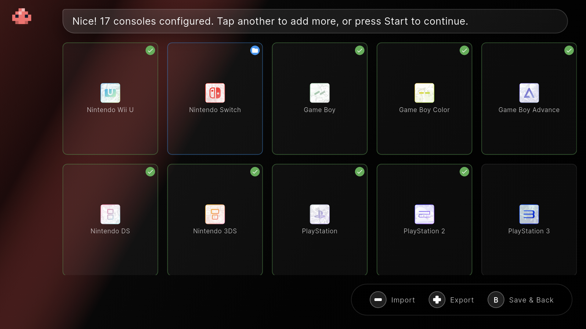

# 🎮 R-Shop

**The eShop your Retro Handheld was missing.**
A premium, console-native game manager for Android. Built for handhelds, perfected for controllers, and designed for the retro community.

  

  
  
  

  
  
  
  

---

## 🌟 What is R-Shop?

R-Shop is a Flutter-based Android application that provides a **seamless, console-like experience** for browsing, downloading, and organizing your retro game library. 

It bridges the gap between your self-hosted storage (**RomM, SMB, FTP, Web**) and your handheld device, providing a native UI that feels like it was built by a major console manufacturer. Optimized specifically for the **AYN Odin, Retroid Pocket, Anbernic** and other Android-based handhelds.

> **🛡️ Neutrality Policy:** R-Shop is a technical tool and directory browser. It does **not** host, distribute, or provide links to copyrighted content. You provide the sources; R-Shop provides the experience.

---

## ✨ Key Features

* **🎮 Console-Native UI** – 100% D-pad and analog navigation. Features haptic feedback, mechanical click sounds, and correct controller icons.
* **🌐 Multi-Protocol Mastery** – Connect to **RomM, SMB, FTP, or Web** directories. Mix and match sources for every single console in your library.
* **📚 Library Screen** – Unified cross-system browser with All/Installed/Favorites tabs, search, and adjustable grid zoom.
* **📥 Hardened Download Engine** – Background-ready downloads via Android Foreground Service. Features auto-extraction (ZIP/7z) and queue persistence.
* **🖼️ Automatic Box Art** – Metadata and covers are fetched automatically via libretro-thumbnails.
* **🏆 RetroAchievements** – Link your RA account to track achievements, verify ROMs via hash matching, and view per-game progress with mastery badges.
* **⚡ Quick Menu (Start Button)** – Instant access to Search, Settings, Zoom, and Downloads from any screen.
* **🔄 Background Sync** – Automatic provider sync on launch with live progress indicators.
* **🧭 Smart Onboarding** – Auto-detection of existing ROM folders and guided setup for remote sources.

---

## 📸 Screenshots

  
  

  
  

---

## 🗂️ Supported Systems (29 systems · 200+ file formats)

| Nintendo | Sony | SEGA | Atari | Other |
|----------|------|------|-------|-------|
| NES, SNES, N64 | PlayStation | Master System | 2600 | PICO-8 |
| GameCube, Wii, Wii U | PlayStation 2, PS3 | Mega Drive, Game Gear | 5200, 7800 | |
| Switch | PSP, PS Vita | Sega CD, 32X | Lynx | |
| GB, GBC, GBA, DS, 3DS | | Saturn, Dreamcast | | |

---

## 📲 Installation

### 🚀 The Best Way: Obtainium
Keep R-Shop updated automatically and never miss a release. Click the button below on your Android device to add R-Shop directly to Obtainium:

### 📦 Manual APK
Download the latest `.apk` from the [**Releases**](../../releases) page and install it manually.

---

## 🛠️ Getting Started

1. **Onboarding:** The setup wizard auto-detects existing folders or connects to your RomM, SMB, FTP, or Web sources.
2. **Library Sync:** Watch R-Shop build your local metadata cache automatically on launch.
3. **Download & Play:** Hit 'A' to queue a game. R-Shop handles the download, extraction, and organization.

*For the full walkthrough, see the **[User Guide](docs/USER_GUIDE.md)**.*

---

## 🤝 Contributing & License

Contributions make the community thrive! Check out **[CONTRIBUTING.md](CONTRIBUTING.md)**.
This project is licensed under the **MIT License**.

---

## ⚠️ Disclaimer

R-Shop is a library management tool. It does not provide ROMs. Users must legally own the content they access through their own private servers or directories.
