# R-Shop 架構圖集（深度）

> **基準分支：`main-zh`** ｜ `1.7.0-zh+13` ｜ `com.retro.rshop.tw`
> 搭配 [SPEC.md](SPEC.md) 閱讀。

**與根目錄 [../ARCHITECTURE.md](../ARCHITECTURE.md) 的分工**：

| 文件 | 定位 | 內容 |
|------|------|------|
| [../ARCHITECTURE.md](../ARCHITECTURE.md) | 高階概覽（171 行 / 1 張圖） | 模組劃分、關鍵類別表、技術棧、功能總覽、目錄結構 |
| **本文件** | 深度架構（Mermaid 圖集） | 來源抽象層、下載狀態機與時序、焦點系統、Platform Channel、資料流 |

> ⚠️ 根目錄文件有幾處已知偏差（`FocusSyncManager` 路徑、絕對連結路徑、版本號），校正表見 [SPEC.md §0.2](SPEC.md)。

---

## 1. 整體分層

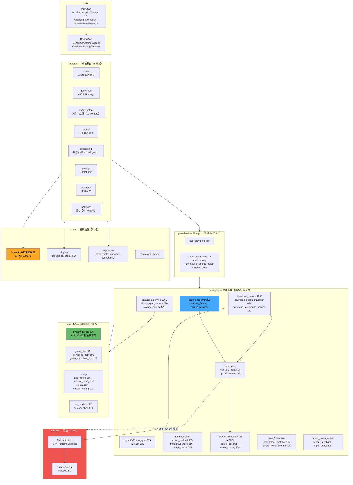

---

## 2. 多來源抽象層（核心設計）

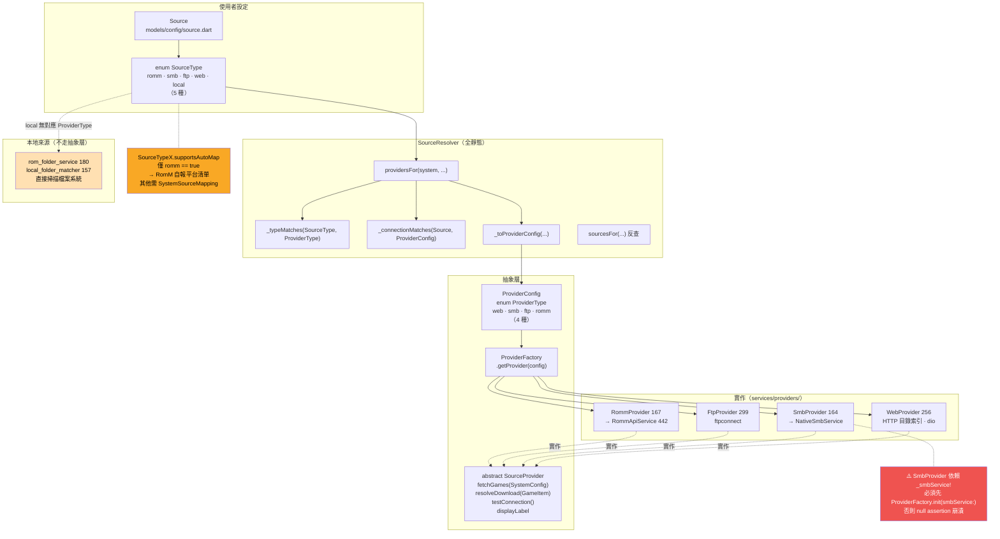

> **兩個列舉不對稱是刻意的**：`local` 沒有網路協定要抽象，直接走檔案系統掃描。新增來源型別時要同時處理兩個列舉與 `_typeMatches`。

---

## 3. 遊戲庫載入流程

```mermaid
sequenceDiagram
    autonumber
    participant UI as game_list / library 畫面
    participant PR as Riverpod providers
    participant UGS as UnifiedGameService
    participant SR as SourceResolver
    participant PF as ProviderFactory
    participant SP as SourceProvider 實作
    participant DB as DatabaseService
    participant SYNC as LibrarySyncService

    UI->>PR: watch(gameProvider(system))
    PR->>UGS: 查詢某主機的遊戲
    UGS->>DB: 先查本地快取（離線可用）
    DB-->>UGS: 已知 GameItem 清單
    UGS-->>UI: 立即回傳（快速顯示）

    par 背景同步
        UGS->>SR: providersFor(system)
        SR->>SR: 比對 SourceType ↔ ProviderType<br/>_connectionMatches 判斷同伺服器
        SR-->>UGS: List&lt;ProviderConfig&gt;（可能多個來源）
        loop 每個 provider
            UGS->>PF: getProvider(config)
            PF-->>UGS: SourceProvider
            UGS->>SP: fetchGames(systemConfig)
            SP-->>UGS: List&lt;GameItem&gt;
        end
        UGS->>SYNC: 合併去重 + 元資料補全
        SYNC->>DB: 寫回 SQLite
        DB-->>PR: 通知變更
        PR-->>UI: 重繪
    end
```

**多來源合併**：同一款遊戲可能同時存在於 RomM 與 SMB → 合併為一筆 `GameItem`，但保留所有來源，供下載失敗時切換（見 §5）。

---

## 4. 下載狀態機

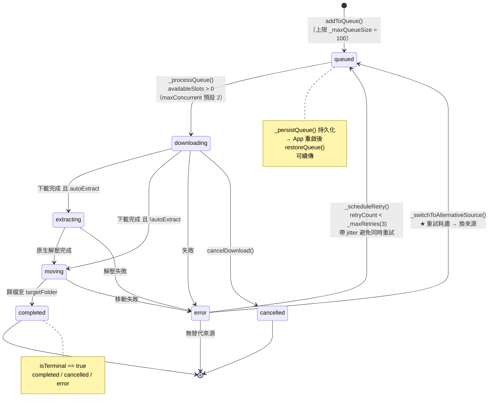

---

## 5. 下載佇列管理時序

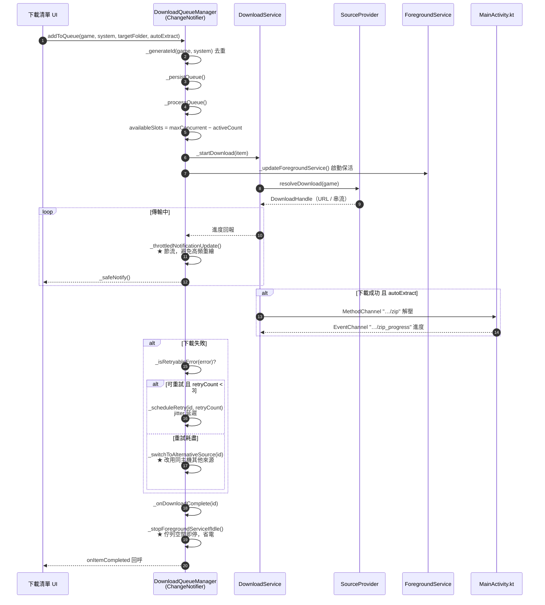

---

## 6. 手把焦點系統（控制器優先的核心）

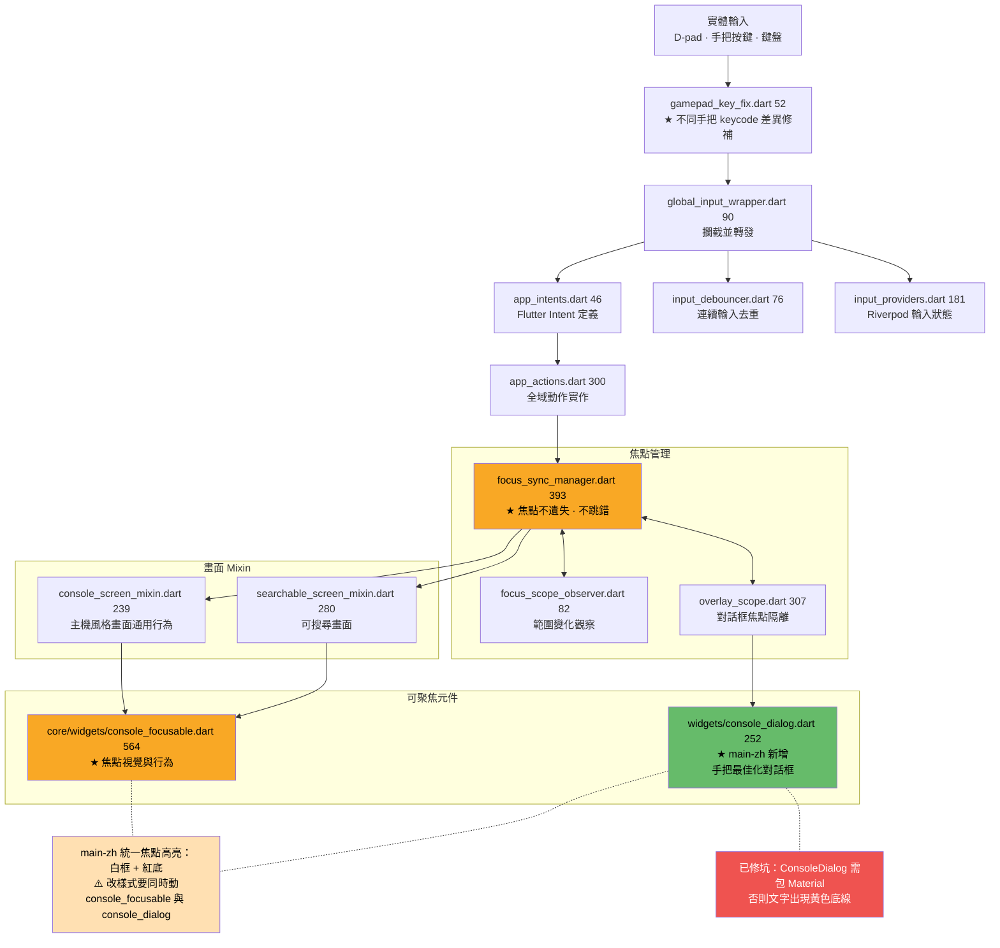

> **新增任何對話框請用 `ConsoleDialog`**，不要直接 `showDialog` —— 否則手把焦點會失效。

---

## 7. Platform Channel（Flutter ↔ Android）

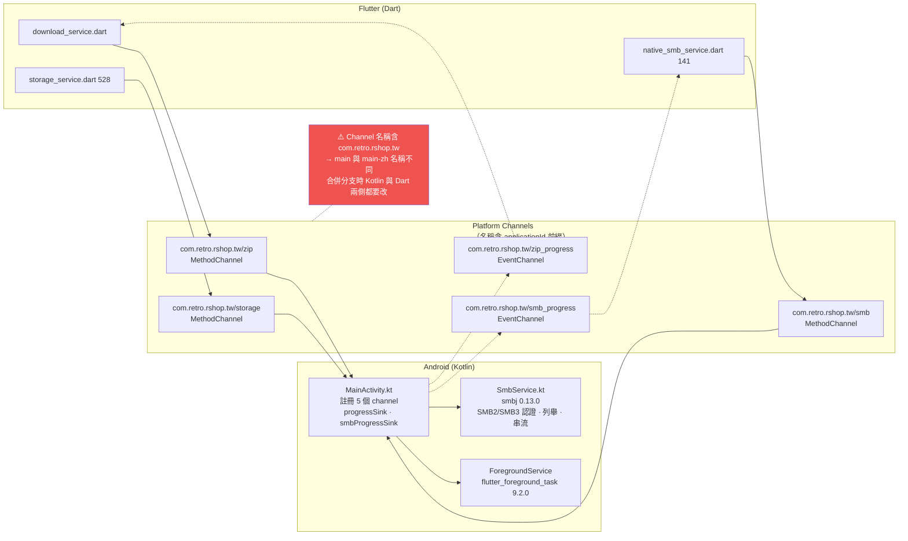

---

## 8. 資料層與快取

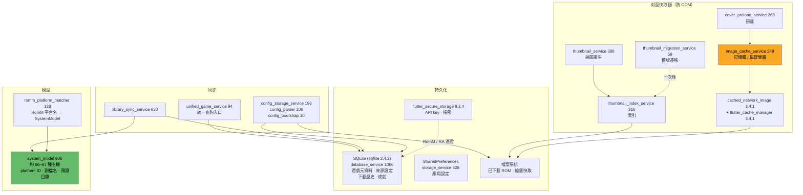

---

## 9. RetroAchievements 整合

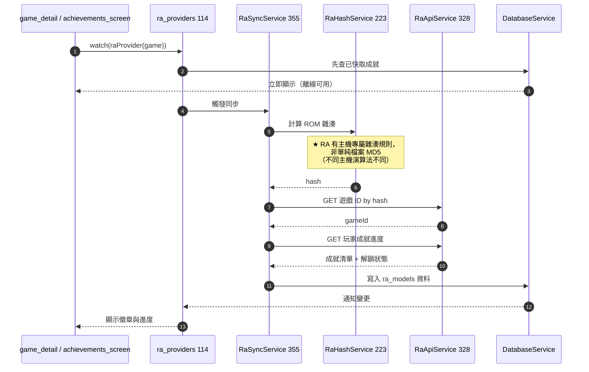

---

## 10. 來源配對（RomM）

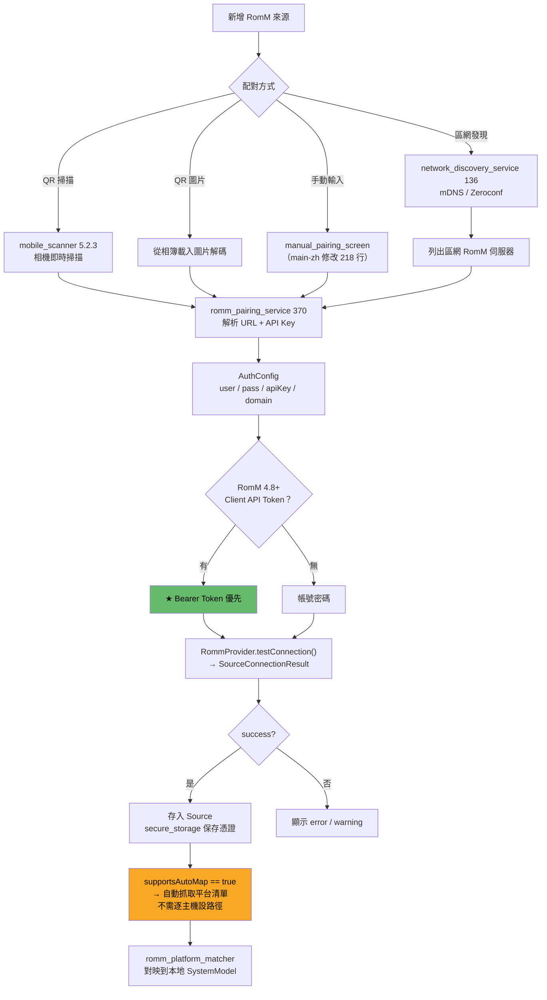

**對比其他來源**（smb / ftp / web / local）：`supportsAutoMap == false`，**必須**為每個主機建立 `SystemSourceMapping` 指定路徑。

---

## 11. 狀態管理現況（兩種模式並存）

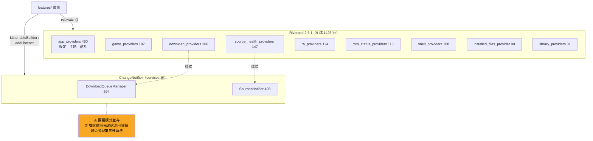

---

## 12. `main-zh` 增量總覽

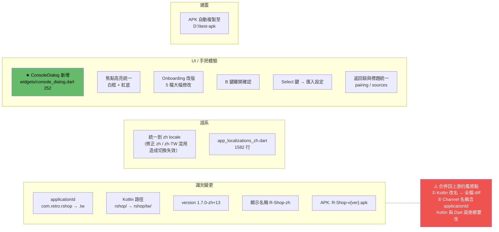
